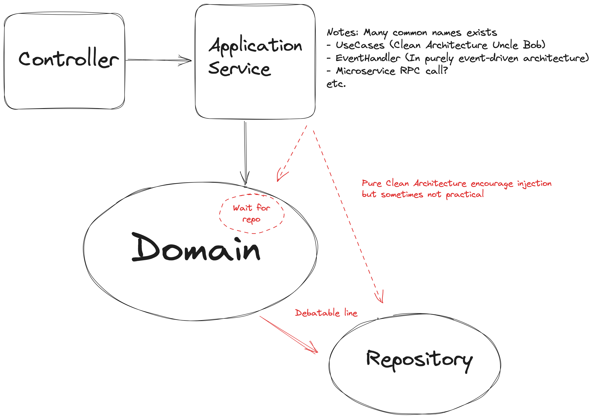

## Structure

## Notable mention

### การระบุ Entity, Value Object

ในที่นี้เราใช้การแบ่ง Namespace ให้เข้าใจว่าอะไรคือ Entity, ValueObject อะไรคือ Value Object

แต่ว่ามันไม่ใช่วิธีการเดียวและ DDD ไม่ได้บอกว่าเราจะแบ่งยังไง อันนี้เป็นเรื่องทางเทคนิคที่ขึ้นอยู่กับภาษา

ท่าที่ใช้บ่อย

- Class inheritance
- Interface
- Namespace/Package

จริงๆ จะใช้แบบแม้แต่ Suffix/Prefix ยังได้เลย แค่ต้องให้คนใช้รู้ว่าอะไรคือ Entity/ValueObject เฉยๆ DDD ไม่ได้บอกไว้ครับ

### การต่อกับระบบภายนอก

การเอาไปประกอบกับฐานข้อมูลและ Controller อยู่นอก Scope ของ DDD แต่ในคลาสนี้เราจะพูดถึงท่าแต่ละท่าและข้อดีข้อเสียด้วยในภายหลัง มันจะมีข้อจำกัดทางเทคโนโลยีเข้ามาเกี่ยวข้องซึ่งนอกสโคป DDD เช่น VehicleRegistrationId เป็นต้น
